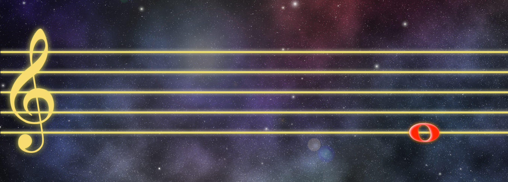

# 🕹️ StaffHero

Controllable, StaffWars-style visual you can drive from **Python** or **Max/MSP** via **OSC**.



---

# What you get

* A **pygame** window with a treble staff.

* Notes **spawn on the right** and **move left**.

* You can **choose exactly which MIDI notes appear and when** by sending OSC messages:
  
  * `/note <midi:int> <velocity:int>` — spawn immediately
  * `/schedule <midi:int> <delay_ms:int>` — spawn after a delay

# Download the ready-to-run scripts

* [Download `staffwars_like.py`](sandbox:/mnt/data/staffwars_like.py)
* [Download `send_test_osc.py`](sandbox:/mnt/data/send_test_osc.py)

# How to run (macOS or Windows)

1. Install VENV and deps (once):

```bash
python3 -m venv ./.venv
source .venv/bin/activate

pip install pygame python-osc
```

2. Start the visualizer:

```bash
python staffwars_like.py
```

3. In another terminal, test-send notes:

```bash
python send_test_osc.py
```

# Controls in the app

* **SPACE** = spawn a random note (from C3..A5 by default)
* **R** = toggle rapid-random mode (auto-spawn)
* **↑ / ↓** = faster / slower scroll speed
* **← / →** = change auto-spawn interval
* **Q / ESC** = quit

# Drive it from Max/MSP (simple)

Use **\[udpsend 127.0.0.1 57120]** and prepend the OSC address:

```
[number box for MIDI note]
|
[t i i]    (set a constant velocity in the right outlet, e.g. 100)
|    \
|     [100]
|      |
[pack i i]
|
[prepend /note]
|
[udpsend 127.0.0.1 57120]
```

To schedule a note for later:

```
[number (MIDI)]     [delay in ms]
      \             /
       [pack i i]
            |
       [prepend /schedule]
            |
   [udpsend 127.0.0.1 57120]
```

# How it works (brief)

* A **Spawner** keeps a list of active notes and a queue of scheduled notes.
* An **OSC** server (127.0.0.1:57120) listens for `/note` and `/schedule`.
* Each frame, notes move left by `speed * dt` and are drawn with basic **ledger lines** and a naive `#` accidental for sharp pitch classes.

# Customize quickly

* Change random pitch range: edit `RANDOM_PITCH_MIN` / `RANDOM_PITCH_MAX` in `staffwars_like.py`.
* Change scroll speed at start: `START_SPEED`.
* Want MIDI-in? Set `USE_MIDI_IN=True` (then `pip install mido python-rtmidi`) and any Note On will spawn.

If you’d like a **Jitter (jit.lcd/jit.gl)** version inside Max so you can keep everything in one patcher, say the word—I can drop a working `[jsui]`/`jit.mgraphics` or `jit.gl.sketch` patch that takes the same OSC messages.

---

## To-Do

* Clefs
* Add second staff (piano view)
* something needs to happen visually when the user plyed the right next note
* NowLine displayed
* option to hear the notes (in browser or so)
* keep the score of the game visible
* implement point system (negative points also)
